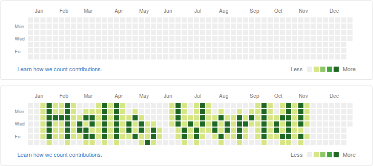

- Outputs the image into your github contributions, using `git commit --date"..."`.

- Start date, and image are set in src/app/core.clj.

- Available colours are:
``` clojure
  {:r 214 :g 230 :b 133} ;; less contributions
  {:r 140 :g 198 :b 101}
  {:r 68 :g 163 :b 64}
  {:r 30 :g 104 :b 35}   ;; more contributions
  ;; anything else is read as the background
 ```

- to build and run:
``` bash
  lein run
  cd commitLog
  chmod +x commitScript.sh
  ./commitScript.sh
```

- The final [result](https://github.com/stevenAvery?tab=overview&from=2014-12-01&to=2014-12-31) of `res/HelloWorld2.png` is:

